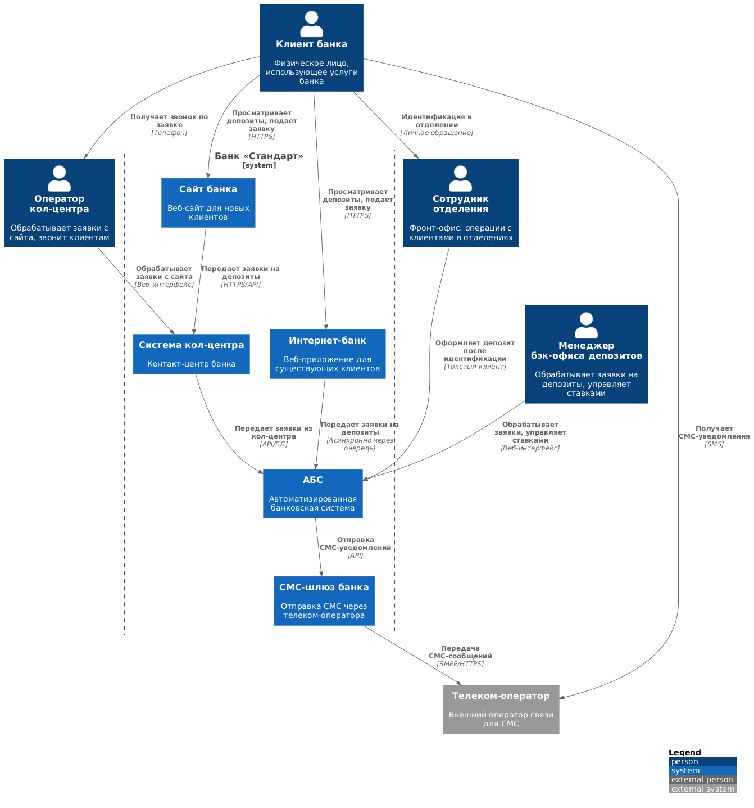
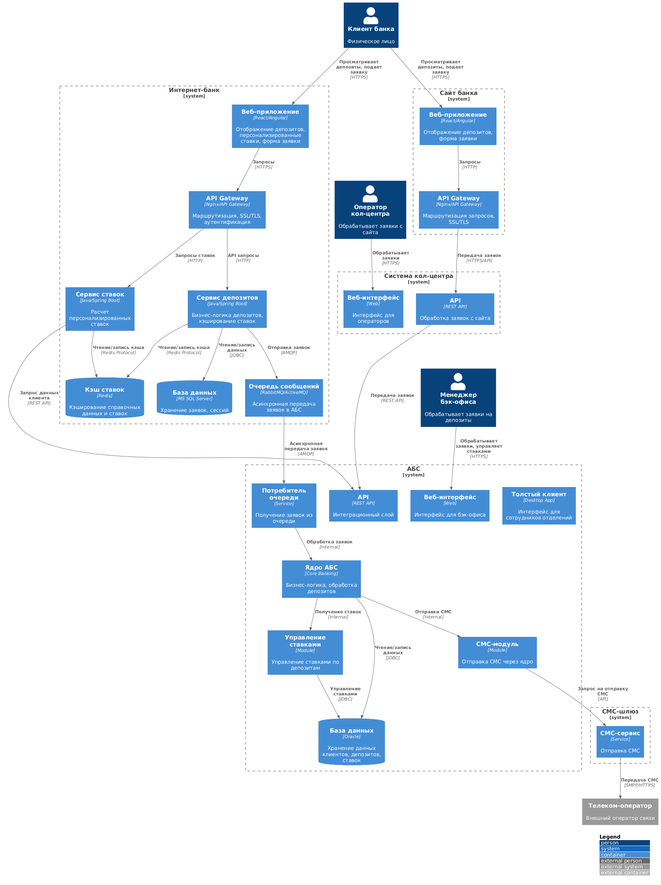

# Задание 3. Открытие депозитов онлайн

## Условия задачи
С вашей помощью команда цифровой трансформации согласовала требования. Теперь нужно определить сроки реализации и стоимость. Этим займётся уже менеджер проекта.

И всё же пока что общая архитектура MVP ясна не до конца. Хочется понять, какие IT-команды должны участвовать в разработке и как разные системы будут взаимодействовать друг с другом.

### Что нужно сделать
Подготовьте схему концептуальной архитектуры открытия депозитов для MVP в формате ADR. В качестве исходных данных используйте:
- Описание требований, которые у вас получились во втором задании.
- Описание технологий, систем и процессов из всего текста проектной работы.
- Описание процессов открытия депозитов, которые мы привели в первом и втором заданиях.

Шаблон ADR расположен [здесь](../adr-template.md). Воспользуйтесь им для оформления архитектурного решения по открытию депозитов онлайн.

В разделе «Решение» нужно привести диаграммы контекста и контейнеров в модели C4 в plantUML с описанием основных компонентов и интеграций всех элементов решения. На диаграмме контейнеров нужно детализировать интернет-банк и АБС. Обратите внимание: диаграмма должна покрывать Use Cases, которые вы также заполняете в шаблоне ADR.
Добавить диаграммы в Markdown-файл не получится. Загрузите их отдельными файлами в папку с решением. Убедитесь, что дали файлам понятные названия. Можете оставить комментарии к диаграммам в разделе «Решение».
Когда будете сдавать решение, загрузите ADR и диаграммы в директорию Task3 в рамках пул-реквеста.

## Решение задачи

**Название задачи:** Архитектура открытия депозитов онлайн (MVP)

**Автор:** Команда цифровой трансформации

**Дата:** 2024

## Функциональные требования

Опишите здесь верхнеуровневые Use Cases. Их нужно оформить в виде таблицы с пошаговым описанием:

|**№**|**Действующие лица или системы**|**Use Case**|**Описание**|
| :-: | :- | :- | :- |
|1|Новый клиент, Сайт банка, Система кол-центра|Подача заявки на депозит через сайт|1. Клиент просматривает список доступных депозитов с актуальными ставками на сайте 2. Клиент заполняет форму заявки (ФИО, номер телефона) 3. Сайт передает заявку в систему кол-центра через защищенное соединение (HTTPS) 4. Оператор кол-центра получает заявку и может предложить особые условия 5. Оператор звонит клиенту для обсуждения условий|
|2|Новый клиент, Сотрудник отделения, АБС|Идентификация нового клиента в отделении|1. После звонка из кол-центра клиент приходит в отделение 2. Сотрудник отделения проводит идентификацию клиента (проверка документов) 3. Сотрудник открывает депозит в АБС на основе заявки из кол-центра|
|3|Существующий клиент, Интернет-банк, АБС|Подача заявки на депозит через интернет-банк|1. Клиент авторизуется в интернет-банке 2. Клиент просматривает список доступных депозитов с актуальными ставками 3. Система отображает персонализированные ставки для клиента 4. Клиент выбирает депозит, указывает счет и сумму 5. Клиент подтверждает операцию СМС-кодом 6. Интернет-банк отправляет заявку в очередь сообщений для асинхронной обработки АБС 7. Клиент получает подтверждение о принятии заявки|
|4|Менеджер бэк-офиса депозитов, АБС|Обработка заявки на депозит менеджером бэк-офиса|1. Менеджер бэк-офиса получает заявку в АБС 2. Менеджер проверяет условия депозита и подтверждает ставку 3. Менеджер может согласовать специальную ставку при необходимости 4. После подтверждения АБС отправляет СМС-уведомление клиенту о подтверждении ставки 5. После открытия депозита АБС отправляет СМС-уведомление об открытии|
|5|Сотрудники бэк-офиса, АБС|Управление ставками по депозитам|1. Сотрудники бэк-офиса депозитов и кредитов управляют ставками через веб-интерфейс АБС 2. Ставки рассчитываются на основе ставки рефинансирования ЦБ и уровня кредитного риска 3. Ставки обновляются ежедневно 4. Система обеспечивает разграничение доступа: сотрудники депозитов и кредитов не имеют доступа к данным друг друга|
|6|Интернет-банк, АБС|Расчет персонализированных ставок|1. Интернет-банк запрашивает данные о клиенте из АБС 2. На основе данных клиента (сумма на счетах, история) рассчитывается персонализированная ставка 3. Персонализированные ставки кэшируются для быстрого отображения|
|7|АБС, СМС-шлюз, Клиент|Отправка СМС-уведомлений|1. АБС инициирует отправку СМС через встроенный СМС-модуль ядра системы 2. СМС-модуль отправляет запрос в СМС-шлюз банка 3. СМС-шлюз передает сообщение телеком-оператору 4. Клиент получает СМС-уведомление|

## Нефункциональные требования

Опишите здесь нефункциональные требования и архитектурно значимые требования.

|**№**|**Требование**|**Комментарий**|
| :-: | :- | :- |
|1|Доступность сервисов 99,9% (24/7)|Требуется реализация отказоустойчивости, резервирования и мониторинга|
|2|Резервирование на уровне ЦОД с возможностью переключения при сбоях|Определяет требования к инфраструктуре и архитектуре развертывания|
|3|Отклик по всем операциям в миллисекундах|Требует оптимизации запросов, кэширования и архитектурных решений|
|4|Загрузка справочных данных менее 1 секунды|Требует внедрения кэширования и оптимизации запросов к БД|
|5|Горизонтальное масштабирование интернет-банка|Определяет архитектурный подход (микросервисы, load balancing)|
|6|Шифрование трафика при передаче чувствительных данных (HTTPS/TLS)|Требуется для защиты данных клиентов|
|7|Избежание прямой работы интернет-банка с API АБС|Требует промежуточного слоя или асинхронной интеграции через очереди|
|8|Использование баз данных MS SQL и Oracle|Ограничивает выбор СУБД для новых компонентов|
|9|Совместимость с существующими платформами разработки|Ограничивает выбор технологий и подходов к разработке|
|10|Использование технологий, по которым есть экспертиза в банке|Влияет на выбор стека технологий и снижает риски проекта|
|11|Документация для дальнейшего расширения системы|Требует документирования архитектуры, API и процессов интеграции|
|12|Логирование и мониторинг всех критических операций|Требуется централизованное логирование и система мониторинга|

## Решение

### Диаграммы архитектуры

Архитектура решения представлена в виде диаграмм C4:
- **Диаграмма контекста** ([context-diagram.puml](context-diagram.puml)) — показывает высокоуровневое взаимодействие между системами и участниками

- **Диаграмма контейнеров** ([container-diagram.puml](container-diagram.puml)) — детализирует внутреннюю структуру интернет-банка и АБС

### Описание компонентов

#### Сайт банка

**Веб-приложение** — фронтенд для новых клиентов, реализован на React или Angular. Отображает список доступных депозитов с актуальными ставками и форму для подачи заявки (ФИО, номер телефона).

**API Gateway** — обеспечивает маршрутизацию запросов, SSL/TLS шифрование для защиты передаваемых данных, балансировку нагрузки.

#### Интернет-банк

**Веб-приложение** — фронтенд для существующих клиентов, реализован на React или Angular с использованием системы дизайна компании. Отображает список депозитов, персонализированные ставки и форму подачи заявки с подтверждением через СМС-код.

**API Gateway** — обеспечивает маршрутизацию запросов, SSL/TLS шифрование, аутентификацию и авторизацию клиентов.

**Сервис депозитов** — микросервис на Java/Spring Boot, реализующий бизнес-логику работы с депозитами:
- Прием заявок от клиентов
- Валидация данных заявки
- Отправка заявок в очередь для асинхронной обработки АБС
- Кэширование справочных данных для быстрого отклика

**Сервис ставок** — микросервис на Java/Spring Boot для расчета персонализированных ставок:
- Запрос данных о клиенте из АБС
- Расчет персонализированных ставок на основе данных клиента
- Кэширование результатов расчета

**Кэш ставок (Redis)** — обеспечивает быстрое получение справочных данных и ставок, решая проблему медленной загрузки данных (менее 1 секунды).

**База данных (MS SQL Server)** — хранит заявки на депозиты, сессии пользователей, временные данные.

**Очередь сообщений (RabbitMQ/ActiveMQ)** — обеспечивает асинхронную передачу заявок в АБС, избегая прямой нагрузки на базу данных АБС. Используется вместо Kafka, так как текущая версия платформы интернет-банка несовместима с Kafka.

#### Система кол-центра

**Веб-интерфейс** — интерфейс для операторов кол-центра для просмотра и обработки заявок с сайта.

**API** — REST API для приема заявок с сайта и передачи их в АБС.

#### АБС

**Толстый клиент** — интерфейс для сотрудников отделений для оформления депозитов после идентификации клиентов.

**Веб-интерфейс** — интерфейс для менеджеров бэк-офиса для обработки заявок и управления ставками.

**API** — REST API для интеграции с внешними системами (интернет-банк, кол-центр).

**Ядро АБС** — основная бизнес-логика обработки депозитов, работа с договорами, проведение операций.

**Управление ставками** — модуль для управления ставками по депозитам, заменяющий Excel-файлы:
- Хранение ставок в базе данных
- Расчет ставок на основе ставки рефинансирования ЦБ и уровня кредитного риска
- Разграничение доступа для сотрудников депозитов и кредитов

**СМС-модуль** — модуль ядра системы для отправки СМС-уведомлений, использует существующий функционал без доработок подрядчиком.

**Потребитель очереди** — сервис для получения заявок из очереди сообщений и передачи их в ядро АБС для обработки.

**База данных (Oracle)** — хранит данные клиентов, депозитов, ставок, заявок.

#### СМС-шлюз

**СМС-сервис** — сервис для отправки СМС через телеком-оператора по протоколу SMPP или HTTPS.

### Описание интеграций

#### Интеграция сайта с кол-центром

Сайт передает заявки на депозиты в систему кол-центра через защищенное HTTPS соединение. Данные шифруются с помощью TLS для защиты чувствительной информации (ФИО, номер телефона).

#### Интеграция интернет-банка с АБС

Интеграция реализована асинхронно через очередь сообщений (RabbitMQ/ActiveMQ) для избежания прямой нагрузки на базу данных АБС:
1. Интернет-банк отправляет заявку в очередь
2. Потребитель очереди в АБС получает заявку
3. Заявка обрабатывается в ядре АБС
4. Результат обработки может быть передан обратно через очередь или через API

Для получения данных о клиенте и расчета персонализированных ставок интернет-банк обращается к API АБС напрямую, но эти запросы легковесные и не создают значительной нагрузки.

#### Интеграция кол-центра с АБС

Система кол-центра передает заявки в АБС через REST API. Операторы кол-центра могут просматривать статусы заявок в АБС.

#### Интеграция АБС с СМС-шлюзом

АБС использует встроенный СМС-модуль ядра системы для отправки уведомлений. СМС-модуль обращается к СМС-шлюзу через API, который передает сообщения телеком-оператору.

### Обоснование архитектурных решений

1. **Микросервисная архитектура для интернет-банка**: Позволяет изолировать новый функционал депозитов, обеспечить горизонтальное масштабирование и постепенный переход на микросервисную архитектуру. Использование Java/Spring Boot обеспечивает совместимость с существующими платформами разработки.

2. **Асинхронная интеграция через очередь**: Решает проблему перегруженности базы данных АБС и обеспечивает отказоустойчивость. Заявки не теряются при временной недоступности АБС.

3. **Кэширование справочных данных**: Использование Redis для кэширования ставок и справочных данных решает проблему медленной загрузки данных (менее 1 секунды) и снижает нагрузку на базу данных.

4. **Управление ставками в АБС**: Перенос управления ставками из Excel-файлов в АБС обеспечивает централизованное управление, автоматизацию расчетов и разграничение доступа для сотрудников депозитов и кредитов.

5. **Использование RabbitMQ/ActiveMQ вместо Kafka**: Текущая версия платформы интернет-банка несовместима с Kafka, поэтому используется RabbitMQ/ActiveMQ, которые совместимы с существующими технологиями.

6. **HTTPS/TLS шифрование**: Обеспечивает защиту чувствительных данных при передаче между клиентом и системами банка.

7. **Резервирование на уровне ЦОД**: Архитектура позволяет развернуть компоненты интернет-банка в нескольких ЦОД для обеспечения отказоустойчивости и доступности 99,9%.

## Альтернативы

### Альтернатива 1: Прямая интеграция интернет-банка с АБС через API

**Описание**: Интернет-банк напрямую обращается к API АБС для отправки заявок.

**Преимущества**: 
- Проще реализация
- Синхронная обработка заявок

**Недостатки**:
- Создает прямую нагрузку на перегруженную базу данных АБС
- Нет отказоустойчивости при недоступности АБС
- Не соответствует требованиям по ограничению нагрузки на АБС

**Решение**: Отклонено из-за риска перегрузки базы данных АБС и отсутствия отказоустойчивости.

### Альтернатива 2: Использование Kafka для очередей сообщений

**Описание**: Использование Kafka для асинхронной передачи заявок.

**Преимущества**:
- Высокая производительность и масштабируемость
- Соответствует стратегическому направлению банка

**Недостатки**:
- Текущая версия платформы интернет-банка несовместима с Kafka
- Требует дополнительных доработок платформы

**Решение**: Отклонено для MVP, но может быть рассмотрено при миграции интернет-банка на новую платформу.

### Альтернатива 3: Хранение ставок в отдельной системе

**Описание**: Создание отдельной системы управления ставками вместо модуля в АБС.

**Преимущества**:
- Изоляция функционала управления ставками
- Независимое масштабирование

**Недостатки**:
- Дополнительная система для поддержки
- Необходимость интеграции с АБС
- Усложнение архитектуры

**Решение**: Отклонено, так как управление ставками логически связано с АБС, и интеграция с существующими процессами проще при размещении в АБС.

## Недостатки, ограничения, риски

### Недостатки

1. **Зависимость от очереди сообщений**: При недоступности очереди сообщений заявки не могут быть переданы в АБС. Необходимо обеспечить мониторинг и автоматическое восстановление очереди.

2. **Асинхронная обработка заявок**: Клиент не получает мгновенное подтверждение об открытии депозита, только подтверждение о принятии заявки. Финальное подтверждение приходит через СМС после обработки менеджером бэк-офиса.

3. **Ручная обработка заявок в MVP**: На этапе MVP заявки обрабатываются вручную менеджером бэк-офиса, что ограничивает скорость обработки и требует участия сотрудников.

### Ограничения

1. **Вертикальное масштабирование АБС**: АБС может масштабироваться только вертикально из-за ограничений базы данных Oracle, что ограничивает возможности по увеличению производительности.

2. **Несовместимость с Kafka**: Текущая версия платформы интернет-банка несовместима с Kafka, что ограничивает выбор технологий для очередей сообщений.

3. **Ограничения по нагрузке на АБС**: База данных АБС перегружена, что требует использования асинхронной интеграции и ограничивает частоту запросов к АБС.

4. **Требование идентификации в отделении**: Новые клиенты должны проходить идентификацию в отделении, что ограничивает возможности полной автоматизации процесса для новых клиентов.

### Риски

1. **Риск перегрузки АБС**: При росте количества заявок может возникнуть перегрузка АБС, несмотря на асинхронную интеграцию. Необходимо мониторить нагрузку и при необходимости ограничивать количество обрабатываемых заявок.

2. **Риск потери заявок**: При сбоях в очереди сообщений или при обработке заявок в АБС возможна потеря заявок. Необходимо реализовать механизмы идемпотентности и повторной обработки.

3. **Риск недоступности сервисов**: При сбоях в ЦОД или инфраструктуре возможна недоступность сервисов. Необходимо обеспечить резервирование и автоматическое переключение между ЦОД.

4. **Риск безопасности**: При передаче чувствительных данных существует риск утечки информации. Необходимо обеспечить шифрование трафика, контроль доступа и аудит операций.

5. **Риск несовместимости технологий**: При использовании новых технологий может возникнуть несовместимость с существующими системами. Необходимо тщательное тестирование интеграций.

6. **Риск недостаточной производительности**: При росте нагрузки кэширование может оказаться недостаточным для обеспечения требуемой производительности. Необходимо мониторить производительность и оптимизировать запросы.
