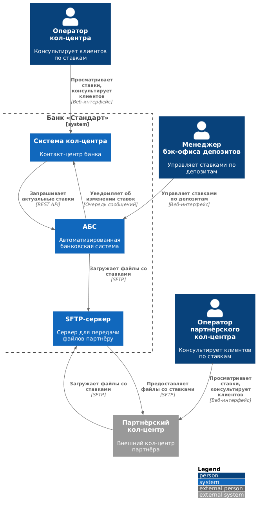
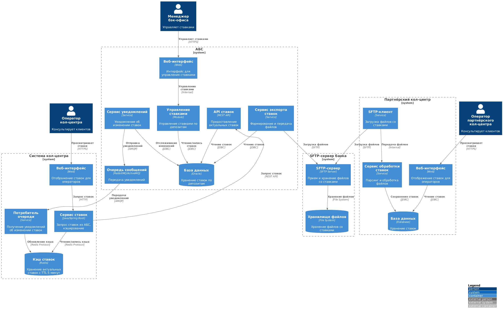
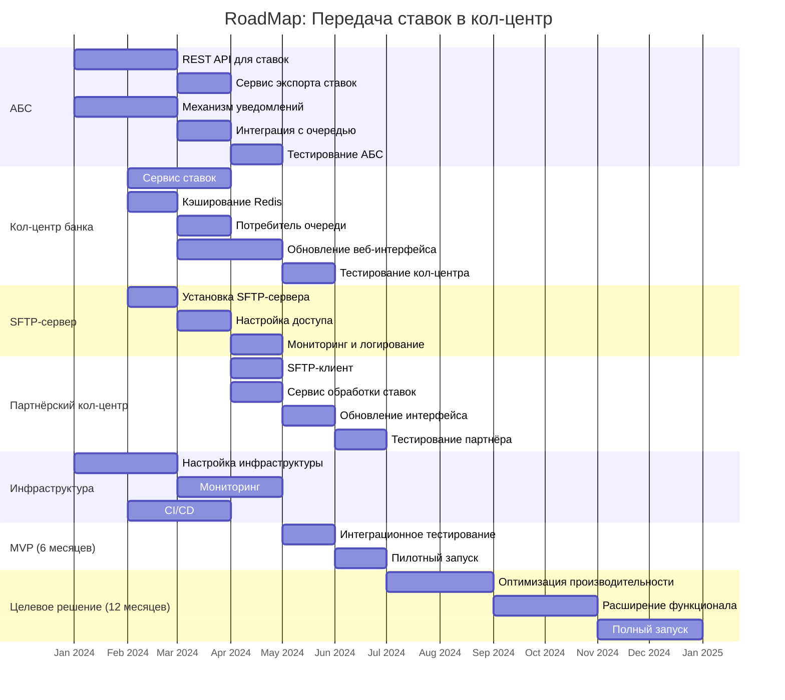

# Задание 4. Передача ставок в кол-центр

## Условия задачи
Менеджер проектов из команды цифровой трансформации занимается подготовкой дорожной карты проекта. Для этого ему нужно определить, в какой последовательности команды должны делать изменения в своих системах. Понять это поможет архитектура MVP, которую вы спроектировали ранее.

Также команда обнаружила проблему: большинство клиентов банка «Стандарт» — пожилые люди. Как только банк запустит маркетинговую кампанию на текущих и на новых клиентов, количество звонков в кол-центр может увеличиться. Есть риск, что возрастным людям будет непросто сориентироваться в новых процессах и они захотят уточнить условия открытия депозита по телефону. 

В ходе анализа проблемы сотрудники банка внесли несколько предложений:
1. Нужно, чтобы сотрудники кол-центра могли проконсультировать клиентов хотя бы по текущим ставкам банка. Для этого надо каким-то образом предоставить их системе доступ к ставкам по депозитам.
2. Есть риск, что кол-центр будет перегружен. Поэтому необходимо подключить к работе партнёрский кол-центр. При этом важно, чтобы сотрудники партнёрского кол-центра также могли проконсультировать клиентов по актуальным депозитным ставкам. Для этого нужно наладить процесс передачи информации об актуальных ставках между банком и кол-центром. Кол-центр партнёра работает во внешней информационной системе относительно банка. Они готовы получать актуальные ставки в виде файлов. Нет возможности сделать API-вызовы (например, через SFTP-протокол).
3. Все эти изменения необходимо учесть в MVP и предложить решение на основе текущего процесса работы со ставками.

### Что нужно сделать
1. Разработайте ADR для новых изменений. Ещё раз заполните шаблон ADR, на этот раз — для нового кейса. Опишите там Use Cases, функциональные и нефункциональные требования, создайте диаграммы контекста и компонентов в модели C4, опишите альтернативы и недостатки для вашего решения. При разработке диаграмм учитывайте и используйте только то, что имеет значение для текущих изменений.
2. Сформируйте список крупных задач для каждой системы из ADR для будущего планирования.
3. Подготовьте RoadMap в mermaid. Это схема последовательности выполнения задач для MVP на горизонте 6 месяцев с учётом изменений в новом кейсе и целевого решения на горизонте года.

**Шаблон ADR:** см. [adr-template.md](../adr-template.md)

## Решение задачи

**Название задачи:** Передача ставок по депозитам в кол-центр банка и партнёрский кол-центр

**Автор:** Команда цифровой трансформации

**Дата:** 2024

## Функциональные требования

Опишите здесь верхнеуровневые Use Cases. Их нужно оформить в виде таблицы с пошаговым описанием:

|**№**|**Действующие лица или системы**|**Use Case**|**Описание**|
| :-: | :- | :- | :- |
|1|Оператор кол-центра банка, Система кол-центра, АБС|Просмотр актуальных ставок по депозитам|1. Оператор кол-центра получает звонок от клиента с вопросом о ставках по депозитам 2. Оператор открывает интерфейс системы кол-центра 3. Система кол-центра запрашивает актуальные ставки из АБС через API 4. АБС возвращает список актуальных ставок по депозитам 5. Оператор видит актуальные ставки и консультирует клиента|
|2|Менеджер бэк-офиса депозитов, АБС|Обновление ставок по депозитам|1. Менеджер бэк-офиса обновляет ставки по депозитам в модуле управления ставками АБС 2. АБС сохраняет новые ставки в базе данных 3. АБС уведомляет систему кол-центра об изменении ставок через механизм обновления кэша 4. АБС формирует файл со ставками для партнёрского кол-центра 5. АБС передает файл на SFTP-сервер для партнёрского кол-центра|
|3|АБС, SFTP-сервер, Партнёрский кол-центр|Передача ставок партнёрскому кол-центру|1. АБС формирует файл со ставками по депозитам в формате CSV/JSON 2. АБС загружает файл на SFTP-сервер банка 3. Партнёрский кол-центр подключается к SFTP-серверу и загружает файл 4. Партнёрский кол-центр обрабатывает файл и обновляет данные о ставках в своей системе 5. Операторы партнёрского кол-центра получают доступ к актуальным ставкам|
|4|АБС, Система кол-центра банка|Автоматическое обновление ставок в кол-центре банка|1. При изменении ставок в АБС система автоматически уведомляет систему кол-центра 2. Система кол-центра обновляет кэш ставок 3. Операторы кол-центра видят актуальные ставки без необходимости обновления страницы|
|5|Система кол-центра банка, АБС|Кэширование ставок в системе кол-центра|1. Система кол-центра запрашивает ставки из АБС при первом обращении 2. Ставки кэшируются в системе кол-центра на определенное время (например, 5 минут) 3. При повторных запросах ставки возвращаются из кэша 4. При истечении времени кэша или при уведомлении об изменении ставки обновляются|

## Нефункциональные требования

Опишите здесь нефункциональные требования и архитектурно значимые требования.

|**№**|**Требование**|**Комментарий**|
| :-: | :- | :- |
|1|Актуальность ставок в кол-центре банка не более 5 минут|Требуется механизм обновления кэша и уведомлений об изменениях|
|2|Актуальность ставок в партнёрском кол-центре не более 1 часа|Требуется регулярная передача файлов через SFTP (например, каждый час или при изменении)|
|3|Безопасность передачи данных через SFTP|Требуется использование шифрования и аутентификации при передаче файлов|
|4|Отказоустойчивость передачи файлов|Требуется механизм повторной отправки при сбоях и логирование операций|
|5|Минимальная нагрузка на АБС|Требуется кэширование ставок в системе кол-центра и оптимизация запросов|
|6|Совместимость с существующими системами|Требуется использование существующих технологий и протоколов|
|7|Аудит изменений ставок|Требуется логирование всех изменений ставок и их передачи в кол-центры|
|8|Формат файла для партнёрского кол-центра|Требуется согласованный формат (CSV/JSON) с партнёром|

## Решение

### Диаграммы архитектуры

Архитектура решения представлена в виде диаграмм C4:
- **Диаграмма контекста** ([context-diagram.puml](context-diagram.puml)) — показывает высокоуровневое взаимодействие между системами и участниками

- **Диаграмма контейнеров** ([container-diagram.puml](container-diagram.puml)) — детализирует внутреннюю структуру систем, участвующих в передаче ставок

### Описание компонентов

#### АБС

- **Модуль управления ставками** — существующий модуль для управления ставками по депозитам:
- **API для передачи ставок** — новый REST API endpoint для предоставления актуальных ставок:
- **Сервис экспорта ставок** — новый сервис для формирования и передачи файлов со ставками:
- **Механизм уведомлений об изменении ставок** — механизм для уведомления системы кол-центра об изменениях:

#### Система кол-центра банка

- **Сервис ставок** — новый микросервис для работы со ставками:
- **Кэш ставок (Redis)** — кэш для хранения актуальных ставок:
- **Веб-интерфейс** — обновление интерфейса для отображения ставок:

#### SFTP-сервер банка

**SFTP-сервер** — сервер для передачи файлов партнёрскому кол-центру:

#### Партнёрский кол-центр

- **SFTP-клиент** — клиент для загрузки файлов со ставками:
- **Сервис обработки ставок** — сервис для обработки загруженных файлов:

### Описание интеграций

#### Интеграция АБС с системой кол-центра банка

Интеграция реализована через REST API:
1. Система кол-центра запрашивает ставки через REST API АБС
2. АБС возвращает актуальные ставки в формате JSON
3. Система кол-центра кэширует ставки в Redis
4. При изменении ставок АБС отправляет уведомление через очередь сообщений
5. Система кол-центра обновляет кэш при получении уведомления

#### Интеграция АБС с партнёрским кол-центром

Интеграция реализована через SFTP:
1. АБС формирует файл со ставками в формате CSV/JSON
2. АБС загружает файл на SFTP-сервер банка
3. Партнёрский кол-центр подключается к SFTP-серверу и загружает файл
4. Партнёрский кол-центр обрабатывает файл и обновляет данные

**Механизм обновления:**
- Регулярная передача файлов (каждый час)
- Передача при изменении ставок (event-driven)
- Логирование всех операций передачи

### Обоснование архитектурных решений

1. **REST API для кол-центра банка**: Позволяет получать актуальные ставки в реальном времени с минимальной задержкой. Кэширование снижает нагрузку на АБС и обеспечивает отказоустойчивость.

2. **SFTP для партнёрского кол-центра**: Соответствует требованиям партнёра, который не может использовать API. SFTP обеспечивает безопасную передачу файлов с шифрованием и аутентификацией.

3. **Кэширование ставок**: Решает проблему нагрузки на АБС и обеспечивает быстрый отклик для операторов кол-центра. TTL 5 минут обеспечивает актуальность данных.

4. **Механизм уведомлений**: Позволяет обновлять кэш в системе кол-центра сразу при изменении ставок, не дожидаясь истечения TTL.

5. **Формат файлов CSV/JSON**: Универсальный формат, легко обрабатывается различными системами. JSON предпочтительнее для структурированных данных, CSV — для простоты.

6. **SFTP-сервер в инфраструктуре банка**: Обеспечивает контроль безопасности и доступности. Банк может управлять доступом и мониторить операции.

## Альтернативы

### Альтернатива 1: Прямой доступ системы кол-центра к базе данных АБС

**Описание**: Система кол-центра напрямую подключается к базе данных АБС для получения ставок.

**Преимущества**: 
- Простота реализации
- Минимальная задержка получения данных

**Недостатки**:
- Нарушение принципа изоляции систем
- Прямая нагрузка на базу данных АБС
- Риск безопасности при прямом доступе к БД
- Сложность управления доступом и аудита

**Решение**: Отклонено из-за рисков безопасности и нагрузки на базу данных АБС.

### Альтернатива 2: Использование API для партнёрского кол-центра

**Описание**: Предоставление REST API для партнёрского кол-центра вместо передачи файлов.

**Преимущества**:
- Реальное время обновления ставок
- Единый механизм для обоих кол-центров
- Меньше сложности в управлении файлами

**Недостатки**:
- Не соответствует требованиям партнёра (нет возможности использовать API)
- Требует изменений в инфраструктуре партнёра
- Дополнительные требования к безопасности для внешнего API

**Решение**: Отклонено, так как партнёрский кол-центр не может использовать API и готов получать только файлы.

### Альтернатива 3: Использование веб-хуков для уведомлений

**Описание**: Использование HTTP webhooks вместо очереди сообщений для уведомлений об изменении ставок.

**Преимущества**:
- Простота реализации
- Прямая доставка уведомлений

**Недостатки**:
- Требует доступности системы кол-центра для получения уведомлений
- Нет гарантии доставки при недоступности системы
- Сложность обработки ошибок и повторных попыток

**Решение**: Отклонено в пользу очереди сообщений, которая обеспечивает гарантию доставки и отказоустойчивость.

### Альтернатива 4: Использование FTP вместо SFTP

**Описание**: Использование FTP-протокола для передачи файлов партнёрскому кол-центру.

**Преимущества**:
- Простота настройки
- Широкая поддержка

**Недостатки**:
- Отсутствие шифрования данных (небезопасно)
- Не соответствует требованиям безопасности банка

**Решение**: Отклонено из-за требований безопасности. SFTP обеспечивает шифрование данных.

## Недостатки, ограничения, риски

### Недостатки

1. **Задержка обновления ставок в партнёрском кол-центре**: Ставки обновляются не в реальном времени, а с задержкой до 1 часа (при регулярной передаче) или при изменении ставок. Это может привести к ситуации, когда оператор партнёрского кол-центра консультирует клиента по устаревшим ставкам.

2. **Зависимость от SFTP-сервера**: При недоступности SFTP-сервера партнёрский кол-центр не может получить актуальные ставки. Необходимо обеспечить высокую доступность SFTP-сервера и мониторинг.

3. **Ручная обработка ошибок передачи файлов**: При сбоях передачи файлов требуется ручное вмешательство для выявления и устранения проблем. Необходимо автоматизировать обработку ошибок и уведомления.

4. **Дополнительная нагрузка на АБС**: Несмотря на кэширование, при большом количестве запросов от системы кол-центра может возникнуть дополнительная нагрузка на АБС. Необходимо мониторить нагрузку и оптимизировать запросы.

### Ограничения

1. **Формат передачи данных для партнёра**: Ограничение форматом файлов (CSV/JSON) может усложнить передачу сложных структур данных в будущем. При необходимости расширения функционала может потребоваться изменение формата.

2. **Частота обновления для партнёра**: Ограничение частоты обновления (не более 1 часа) связано с возможностями партнёрского кол-центра по обработке файлов. При необходимости более частых обновлений может потребоваться оптимизация процесса обработки.

3. **Зависимость от партнёрского кол-центра**: Банк не контролирует процесс обработки файлов в партнёрском кол-центре. При проблемах на стороне партнёра банк может не сразу узнать о них.

4. **Ограничения кэширования**: Кэш в системе кол-центра имеет TTL 5 минут, что может быть недостаточно при частых изменениях ставок. При необходимости более частых обновлений может потребоваться уменьшение TTL, что увеличит нагрузку на АБС.

### Риски

1. **Риск утечки данных**: При передаче файлов через SFTP существует риск утечки данных при компрометации SFTP-сервера или учетных данных. Необходимо обеспечить строгий контроль доступа, шифрование и регулярный аудит.

2. **Риск рассинхронизации данных**: При сбоях в передаче файлов или обработке данных в партнёрском кол-центре может возникнуть рассинхронизация ставок между банком и партнёром. Необходимо реализовать механизмы проверки актуальности данных и уведомления о проблемах.

3. **Риск перегрузки АБС**: При росте количества запросов от системы кол-центра может возникнуть перегрузка АБС, несмотря на кэширование. Необходимо мониторить нагрузку и при необходимости ограничивать частоту запросов или увеличивать TTL кэша.

4. **Риск недоступности SFTP-сервера**: При сбоях в инфраструктуре SFTP-сервера партнёрский кол-центр не сможет получить актуальные ставки. Необходимо обеспечить высокую доступность, резервирование и мониторинг SFTP-сервера.

5. **Риск ошибок в формате файлов**: При изменении структуры данных в АБС может возникнуть несовместимость формата файлов с ожиданиями партнёрского кол-центра. Необходимо обеспечить версионирование форматов и обратную совместимость.

6. **Риск недостаточной производительности кэша**: При большом количестве операторов кол-центра и частых запросах кэш может оказаться недостаточным для обеспечения требуемой производительности. Необходимо мониторить производительность и оптимизировать кэширование.

## Список крупных задач по системам

### АБС

1. **Разработка REST API для передачи ставок**
2. **Разработка сервиса экспорта ставок**
3. **Разработка механизма уведомлений об изменении ставок**
4. **Интеграция с очередью сообщений**
5. **Тестирование и отладка**

### Система кол-центра банка

1. **Разработка сервиса ставок**
2. **Настройка кэширования ставок**
3. **Разработка потребителя очереди уведомлений**
4. **Обновление веб-интерфейса**
5. **Интеграционное тестирование**

### SFTP-сервер банка

1. **Установка и настройка SFTP-сервера**
2. **Настройка доступа для партнёрского кол-центра**
3. **Настройка мониторинга и логирования**
4. **Документирование и передача партнёру**

### Партнёрский кол-центр

1. **Разработка SFTP-клиента**
2. **Разработка сервиса обработки ставок**
3. **Обновление веб-интерфейса**
4. **Интеграционное тестирование**

### Инфраструктура и DevOps

1. **Настройка инфраструктуры**
2. **Настройка мониторинга**
3. **Настройка CI/CD**

## RoadMap

Дорожная карта реализации проекта на горизонт 6 месяцев (MVP) и 12 месяцев (целевое решение):

