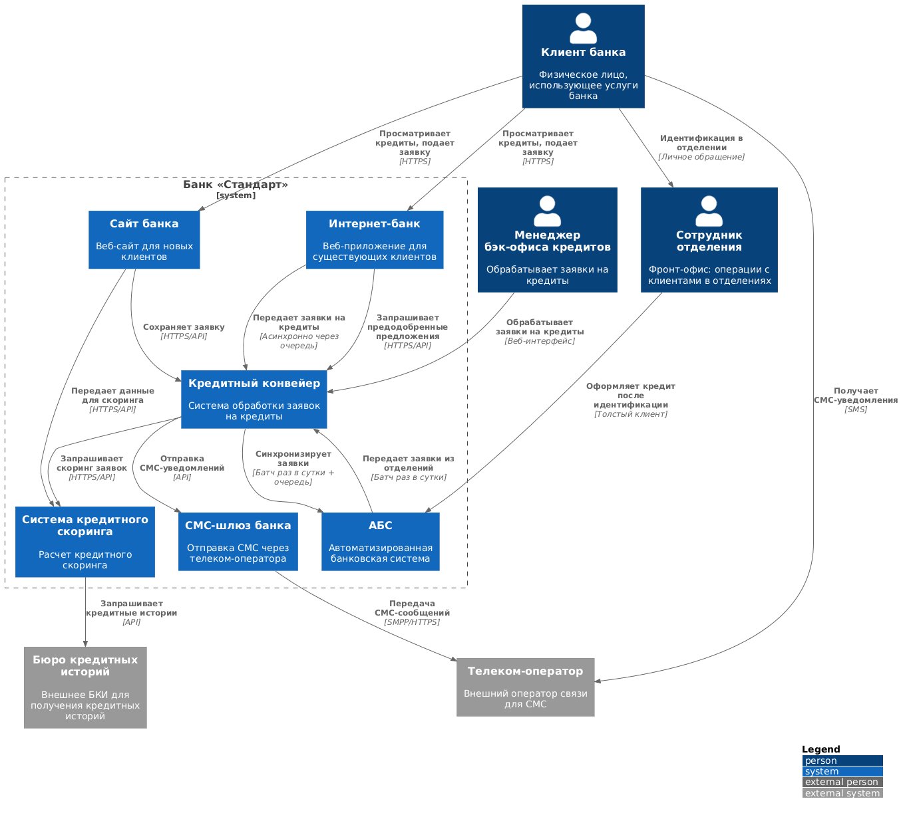
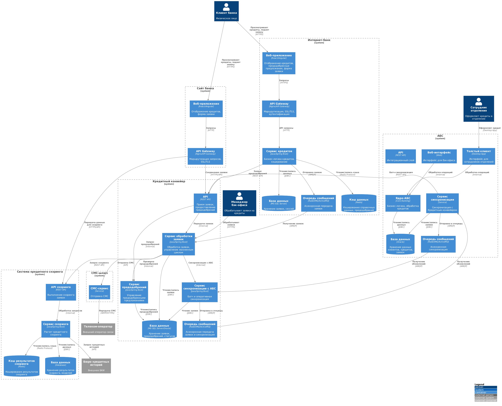

# Задание 5. Заявка на кредит онлайн

## Условия задачи

Решено, что кредитный процесс с подачей заявки онлайн надо сделать в рамках одного года после MVP. На основе FURPS+ требований для кредитного процесса сделайте решение в формате ADR в C4. При разработке диаграмм учитывайте и используйте только то, что имеет значение для текущих изменений.

### Что нужно сделать
Разработайте ADR для новых изменений. 
- Ещё раз заполните шаблон ADR, на этот раз — для нового кейса. Опишите там Use Cases и функциональные требования.
- Опишите нефункциональные и архитектурно значимые требования.
- Создайте диаграммы контекста и компонентов в модели C4.
- Опишите альтернативы для вашего решения.
- Опишите ограничения вашего решения.

**Шаблон ADR**: см. [adr-template.md](../adr-template.md)

## Решение задачи

**Название задачи:** Архитектура подачи заявок на кредит онлайн

**Автор:** Команда цифровой трансформации

## Функциональные требования

Опишите здесь верхнеуровневые Use Cases. Их нужно оформить в виде таблицы с пошаговым описанием:

|**№**|**Действующие лица или системы**|**Use Case**|**Описание**|
| :-: | :- | :- | :- |
|1|Новый клиент, Сайт банка, Система кредитного скоринга, Бюро кредитных историй|Подача заявки на кредит через сайт с предварительным одобрением|1. Клиент просматривает предложение по кредиту на сайте 2. Клиент заполняет форму заявки (ФИО, номер телефона, паспортные данные) 3. Сайт передает данные в систему кредитного скоринга 4. Система скоринга запрашивает данные из БКИ (общие данные для новых клиентов) 5. Система скоринга возвращает решение об одобрении или неодобрении кредита 6. Сайт отображает результат клиенту 7. Система отправляет СМС клиенту о необходимости прийти в отделение для получения кредита и идентификации 8. Заявка сохраняется в Кредитном конвейере|
|2|Новый клиент, Сотрудник отделения, АБС, Кредитный конвейер|Продолжение работы с заявкой на кредит в отделении|1. Клиент приходит в отделение после подачи заявки на сайте 2. Сотрудник отделения проводит идентификацию клиента 3. Сотрудник находит заявку в АБС (связанную с заявкой на сайте) 4. Сотрудник продолжает работу с существующей заявкой или создает новую для полностью нового клиента 5. Сотрудник оформляет кредит в АБС|
|3|Существующий клиент, Интернет-банк, Система кредитного скоринга, Кредитный конвейер|Подача заявки на кредит через интернет-банк|1. Клиент авторизуется в интернет-банке 2. Клиент просматривает список доступных кредитов с актуальными условиями 3. Система отображает предодобренные предложения по кредиту (если есть) 4. Клиент выбирает кредит, указывает счет зачисления средств и данные для заявки 5. Клиент подтверждает операцию СМС-кодом 6. Интернет-банк отправляет заявку в очередь для обработки 7. Если есть предодобренное предложение, выполняется упрощенный скоринг 8. Заявка передается в Кредитный конвейер для обработки|
|4|Менеджер бэк-офиса кредитов, Кредитный конвейер, АБС|Обработка заявки на кредит менеджером бэк-офиса|1. Менеджер бэк-офиса получает заявку в Кредитном конвейере 2. Менеджер проверяет данные заявки и условия кредита 3. Менеджер принимает решение об одобрении или отклонении заявки 4. При одобрении менеджер подтверждает условия кредита 5. Кредитный конвейер отправляет СМС-уведомление клиенту об изменении статуса заявки 6. Заявка синхронизируется с АБС (раз в сутки или при изменении статуса)|
|5|Интернет-банк, Кредитный конвейер|Отображение предодобренных предложений|1. Интернет-банк запрашивает предодобренные предложения из Кредитного конвейера 2. Кредитный конвейер возвращает список предодобренных кредитов с условиями 3. Интернет-банк отображает предодобренные предложения клиенту 4. Предодобренные предложения кэшируются для быстрого отображения|
|6|Кредитный конвейер, Система кредитного скоринга, Клиент|Повторный скоринг при подаче заявки на предодобренный кредит|1. Клиент подает заявку на предодобренный кредит 2. Кредитный конвейер инициирует упрощенный скоринг 3. Система скоринга выполняет упрощенную процедуру скоринга (используя кэшированные данные) 4. Система скоринга возвращает результат 5. Заявка обрабатывается с приоритетом (в течение рабочего дня)|
|7|Кредитный конвейер, СМС-шлюз, Клиент|Отправка СМС-уведомлений о статусе заявки|1. Кредитный конвейер инициирует отправку СМС при изменении статуса заявки 2. СМС отправляется через СМС-шлюз банка 3. Клиент получает СМС-уведомление о статусе заявки|
|8|АБС, Кредитный конвейер|Синхронизация заявок между АБС и Кредитным конвейером|1. АБС формирует пакет заявок для передачи в Кредитный конвейер 2. Заявки передаются в Кредитный конвейер раз в сутки (батч-режим) 3. Кредитный конвейер обрабатывает заявки 4. При изменении статуса заявки в Кредитном конвейере статус синхронизируется обратно в АБС 5. Для предодобренных заявок используется механизм оперативной синхронизации|

## Нефункциональные требования

Опишите здесь нефункциональные требования и архитектурно значимые требования.

|**№**|**Требование**|**Комментарий**|
| :-: | :- | :- |
|1|Доступность сервисов 99,9% (24/7)|Требуется реализация отказоустойчивости, резервирования и мониторинга для всех систем|
|2|Обработка заявок по предодобренным предложениям в течение рабочего дня|Требует оптимизации процесса синхронизации с Кредитным конвейером (сейчас раз в сутки)|
|3|Минимизация нагрузки на систему кредитного скоринга в рабочие часы|Требует реализации механизмов кэширования, батчинга или асинхронной обработки|
|4|Отклик по всем операциям в миллисекундах|Требует оптимизации запросов, кэширования и архитектурных решений|
|5|Горизонтальное масштабирование интернет-банка и Кредитного конвейера|Определяет архитектурный подход (микросервисы, load balancing)|
|6|Шифрование трафика при передаче чувствительных данных (HTTPS/TLS)|Требуется для защиты данных клиентов (паспортные данные, персональная информация)|
|7|Избежание прямой работы интернет-банка с API АБС|Требует промежуточного слоя или асинхронной интеграции через очереди|
|8|Связывание заявок на кредит, поданных на сайте и в отделении|Требует механизма идентификации и связывания заявок между каналами|
|9|Использование баз данных MS SQL и Oracle|Ограничивает выбор СУБД для новых компонентов|
|10|Совместимость с существующими платформами разработки|Ограничивает выбор технологий и подходов к разработке|
|11|Использование технологий, по которым есть экспертиза в банке|Влияет на выбор стека технологий и снижает риски проекта|
|12|Документация для дальнейшего расширения системы|Требует документирования архитектуры, API и процессов интеграции|
|13|Логирование и мониторинг всех критических операций|Требуется централизованное логирование и система мониторинга|
|14|Обработка ошибок при недоступности внешних систем (скоринг, БКИ)|Требуется graceful degradation и механизмы retry с экспоненциальной задержкой|
|15|Обмен данными между АБС и Кредитным конвейером раз в сутки, ускорение невозможно|Требует альтернативных механизмов для оперативной обработки предодобренных заявок|
|16|Система кредитного скоринга не должна нагружаться предрасчетами|Требует кэширования результатов скоринга или использования отдельного механизма для предодобрений|
|17|Кредитный конвейер и система кредитного скоринга поддерживают горизонтальное масштабирование|Определяет возможности масштабирования для обработки растущей нагрузки|

## Решение

### Диаграммы архитектуры

Архитектура решения представлена в виде диаграмм C4:
- **Диаграмма контекста** ([context-diagram.puml](context-diagram.puml)) — показывает высокоуровневое взаимодействие между системами и участниками

- **Диаграмма контейнеров** ([container-diagram.puml](container-diagram.puml)) — детализирует внутреннюю структуру систем, участвующих в процессе подачи заявок на кредит

### Описание компонентов

#### Сайт банка

- **Веб-приложение** — фронтенд для новых клиентов, реализован на React или Angular. Отображает предложения по кредитам и форму для подачи заявки (ФИО, номер телефона, паспортные данные).
- **API Gateway** — обеспечивает маршрутизацию запросов, SSL/TLS шифрование для защиты передаваемых данных, балансировку нагрузки.

#### Интернет-банк

- **Веб-приложение** — фронтенд для существующих клиентов, реализован на React или Angular с использованием системы дизайна компании. Отображает список кредитов, предодобренные предложения и форму подачи заявки с подтверждением через СМС-код.
- **API Gateway** — обеспечивает маршрутизацию запросов, SSL/TLS шифрование, аутентификацию и авторизацию клиентов.
- **Сервис кредитов** — микросервис на Java/Spring Boot, реализующий бизнес-логику работы с кредитами:
- **Кэш данных (Redis)** — обеспечивает быстрое получение справочных данных, предодобренных предложений и результатов скоринга.
- **База данных (MS SQL Server)** — хранит заявки на кредиты, сессии пользователей, временные данные.
- **Очередь сообщений (RabbitMQ/ActiveMQ)** — обеспечивает асинхронную передачу заявок в Кредитный конвейер.

#### Кредитный конвейер

- **API** — REST API для приема заявок и предоставления предодобренных предложений.
- **Сервис предодобрений** — сервис для управления предодобренными предложениями:
- **Сервис синхронизации с АБС** — сервис для синхронизации заявок с АБС:
- **База данных (MS SQL Server/Oracle)** — хранит заявки на кредиты, предодобренные предложения, статусы заявок.
- **Очередь сообщений (RabbitMQ/ActiveMQ)** — обеспечивает асинхронную передачу заявок и синхронизацию с АБС.

#### Система кредитного скоринга

- **API скоринга** — REST API для выполнения скоринга заявок.
- **Сервис скоринга** — основной сервис для расчета кредитного скоринга:
- **Кэш результатов скоринга (Redis)** — кэширование результатов скоринга для снижения нагрузки в рабочие часы.
- **База данных** — хранит результаты скоринга, модели скоринга.

#### АБС

- **Толстый клиент** — интерфейс для сотрудников отделений для оформления кредитов после идентификации клиентов.
- **Веб-интерфейс** — интерфейс для менеджеров бэк-офиса для обработки заявок.
- **API** — REST API для интеграции с внешними системами (Кредитный конвейер).
- **Ядро АБС** — основная бизнес-логика обработки кредитов, работа с договорами.
- **Сервис синхронизации с Кредитным конвейером** — сервис для синхронизации заявок:
- **База данных (Oracle)** — хранит данные клиентов, кредитов, заявок.
- **Очередь сообщений (RabbitMQ/ActiveMQ)** — обеспечивает асинхронную синхронизацию с Кредитным конвейером.

#### СМС-шлюз

- **СМС-сервис** — сервис для отправки СМС через телеком-оператора по протоколу SMPP или HTTPS.

#### Бюро кредитных историй (БКИ)

- **API БКИ** — внешний API для получения кредитных историй клиентов.

### Описание интеграций

#### Интеграция сайта с системой кредитного скоринга

Сайт передает данные заявки в систему кредитного скоринга через защищенное HTTPS соединение. Система скоринга запрашивает данные из БКИ для новых клиентов и возвращает решение об одобрении или неодобрении. Результат отображается клиенту, и заявка сохраняется в Кредитном конвейере.

#### Интеграция интернет-банка с Кредитным конвейером

1. Интернет-банк отправляет заявку в очередь
2. Кредитный конвейер получает заявку из очереди
3. Для предодобренных заявок выполняется упрощенный скоринг
4. Заявка обрабатывается с приоритетом (в течение рабочего дня)
5. Статус заявки синхронизируется обратно через очередь

#### Интеграция Кредитного конвейера с АБС

Интеграция реализована в двух режимах:
1. **Батч-синхронизация** (раз в сутки): АБС передает пакет заявок в Кредитный конвейер
2. **Оперативная синхронизация** (для предодобренных заявок): через очередь сообщений для обработки в течение рабочего дня

При изменении статуса заявки в Кредитном конвейере статус синхронизируется обратно в АБС через очередь сообщений.

#### Интеграция Кредитного конвейера с системой кредитного скоринга

Кредитный конвейер обращается к системе скоринга для выполнения скоринга заявок:
- Полный скоринг для новых клиентов (с запросом данных из БКИ)
- Упрощенный скоринг для предодобренных заявок (с использованием кэшированных данных)

#### Интеграция системы скоринга с БКИ

Система скоринга запрашивает кредитные истории из БКИ через API. Для новых клиентов используются общие данные БКИ. Запросы к БКИ кэшируются для снижения нагрузки и стоимости запросов.

#### Интеграция Кредитного конвейера с СМС-шлюзом

Кредитный конвейер отправляет СМС-уведомления клиентам через СМС-шлюз при изменении статуса заявки.

### Обоснование архитектурных решений

1. **Асинхронная интеграция через очередь**: Решает проблему синхронизации между АБС и Кредитным конвейером (раз в сутки) для предодобренных заявок. Позволяет обрабатывать заявки в течение рабочего дня через очередь сообщений, минуя ограничение батч-синхронизации.
2. **Кэширование результатов скоринга**: Использование Redis для кэширования результатов скоринга снижает нагрузку на систему кредитного скоринга в рабочие часы и ускоряет обработку предодобренных заявок.
3. **Приоритетная обработка предодобренных заявок**: Механизм приоритетной обработки в Кредитном конвейере обеспечивает обработку предодобренных заявок в течение рабочего дня.
4. **Связывание заявок между каналами**: Механизм идентификации и связывания заявок позволяет сотрудникам отделений продолжать работу с заявками, поданными на сайте, используя уникальные идентификаторы.
5. **Оперативная синхронизация для предодобренных заявок**: Использование очереди сообщений для оперативной синхронизации статусов заявок между Кредитным конвейером и АБС позволяет обойти ограничение батч-синхронизации раз в сутки.
6. **Горизонтальное масштабирование**: Кредитный конвейер и система скоринга поддерживают горизонтальное масштабирование, что позволяет обрабатывать растущую нагрузку.
7. **HTTPS/TLS шифрование**: Обеспечивает защиту чувствительных данных (паспортные данные, персональная информация) при передаче между системами.
8. **Graceful degradation**: При недоступности внешних систем (БКИ, скоринг) система продолжает работу с ограниченным функционалом, обеспечивая базовую обработку заявок.

## Альтернативы

### Альтернатива 1: Прямая синхронная интеграция интернет-банка с АБС

**Описание**: Интернет-банк напрямую обращается к API АБС для отправки заявок синхронно.

**Преимущества**: 
- Проще реализация
- Синхронная обработка заявок
- Мгновенное получение результата

**Недостатки**:
- Создает прямую нагрузку на перегруженную базу данных АБС
- Нет отказоустойчивости при недоступности АБС
- Не соответствует требованиям по ограничению нагрузки на АБС
- Не решает проблему синхронизации раз в сутки

**Решение**: Отклонено из-за риска перегрузки базы данных АБС и отсутствия отказоустойчивости.

### Альтернатива 2: Использование прямых запросов к системе скоринга без кэширования

**Описание**: Каждый раз при необходимости выполняется прямой запрос к системе кредитного скоринга без использования кэша.

**Преимущества**:
- Всегда актуальные данные
- Проще реализация

**Недостатки**:
- Создает дополнительную нагрузку на систему скоринга в рабочие часы
- Не соответствует требованию о минимизации нагрузки на систему скоринга
- Медленнее обработка заявок

**Решение**: Отклонено из-за риска перегрузки системы кредитного скоринга и несоответствия требованиям.

## Недостатки, ограничения, риски

### Недостатки

1. **Зависимость от очереди сообщений**: При недоступности очереди сообщений заявки не могут быть переданы в Кредитный конвейер. Необходимо обеспечить мониторинг и автоматическое восстановление очереди.
2. **Асинхронная обработка заявок**: Клиент не получает мгновенное подтверждение об одобрении кредита, только подтверждение о принятии заявки. Финальное подтверждение приходит через СМС после обработки менеджером бэк-офиса.
3. **Ручная обработка заявок**: На этапе MVP заявки обрабатываются вручную менеджером бэк-офиса, что ограничивает скорость обработки и требует участия сотрудников.
4. **Задержка синхронизации для обычных заявок**: Обычные заявки (не предодобренные) синхронизируются с АБС раз в сутки, что создает задержку в обработке.
5. **Зависимость от внешних систем**: Система зависит от доступности БКИ и системы кредитного скоринга. При недоступности этих систем предварительное одобрение невозможно.

### Ограничения

1. **Батч-синхронизация с АБС**: Обмен данными между АБС и Кредитным конвейером происходит раз в сутки, ускорение невозможно. Это ограничивает оперативность обработки обычных заявок.
2. **Вертикальное масштабирование АБС**: АБС может масштабироваться только вертикально из-за ограничений базы данных Oracle, что ограничивает возможности по увеличению производительности.
3. **Ограничения по нагрузке на систему скоринга**: Система кредитного скоринга не должна нагружаться предрасчетами, что требует использования кэширования и ограничивает частоту запросов.
4. **Требование идентификации в отделении**: Новые клиенты должны проходить идентификацию в отделении, что ограничивает возможности полной автоматизации процесса для новых клиентов.
5. **Несовместимость с Kafka**: Текущая версия платформы интернет-банка несовместима с Kafka, что ограничивает выбор технологий для очередей сообщений.
6. **Зависимость от БКИ**: Для новых клиентов доступны только общие данные БКИ, что может ограничивать точность скоринга.
